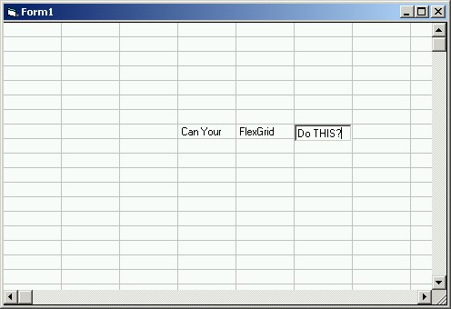



## Edit Flex\-Grid in place\.

### Description

Amazingly easy method for editing flex-grids in place. This is an example that I created to help someone out who needed to edit a flex-grid in place and didn't want to get a third party grid. It is a good starting point for a custom grid control. Good, bad or ugly, comments are always welcome.

M@
 
### More Info
 

             |
---                |---
**Submitted On**   |2001-05-25 01:48:42
**By**             |[Matthew Roberts](https://github.com/Planet-Source-Code/PSCIndex/blob/master/ByAuthor/matthew-roberts.md)
**Level**          |Beginner
**User Rating**    |4.0 (32 globes from 8 users)
**Compatibility**  |VB 4\.0 \(32\-bit\), VB 5\.0, VB 6\.0
**Category**       |[Custom Controls/ Forms/  Menus](https://github.com/Planet-Source-Code/PSCIndex/blob/master/ByCategory/custom-controls-forms-menus__1-4.md)
**World**          |[Visual Basic](https://github.com/Planet-Source-Code/PSCIndex/blob/master/ByWorld/visual-basic.md)
**Archive File**   |[Edit Flex\-200545252001\.zip](https://github.com/Planet-Source-Code/matthew-roberts-edit-flex-grid-in-place__1-23425/archive/master.zip)

